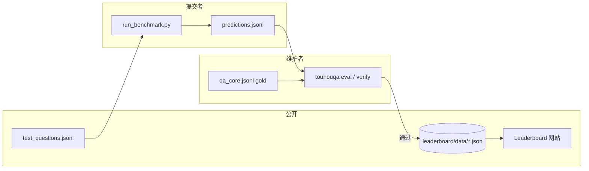

# TouhouQA Leaderboard 设计

面向 **knowledge benchmark** 的公开排行榜：可复现、可审计、与 frozen benchmark 版本绑定。网站只读展示；判分与上榜逻辑以本仓库数据与脚本为准。

---

## 1. 目标与原则

| 原则 | 说明 |
|------|------|
| **版本冻结** | 每条成绩必须绑定 `benchmark_id` + `benchmark_version`（含 gold 文件 SHA256） |
| **隐藏答案** | 公开集仅 `id` + `question`；gold 不进入公开 git / 前端 bundle |
| **可复现** | 提交需包含：预测文件校验和、评测报告、推理配置（prompt / temperature / model id） |
| **主榜单一指标** | 默认排序：**Exact Match Accuracy**（与 `touhouqa eval` / `touhouqa.benchmark.grading` 一致） |
| **无 train** | 不提供训练集；holdout 仅维护者内部使用 |

**主榜（Primary）**：`touhouqa-core-v1` — 经 `touhouqa filter-core` 筛选后的 Core 子集（当前约 2.5k QA）。

**扩展榜（Secondary）**：`touhouqa-test-v1` — 完整 `test.jsonl`（约 3.4k QA），用于覆盖度对比，站点上单独 tab，不与 Core 混排。

---

## 2. 系统架构



### 2.1 阶段划分

| 阶段 | 提交方式 | 适用 |
|------|----------|------|
| **MVP（v1）** | GitHub PR：上传 `predictions.jsonl` + `eval_report.json` + `entry.json` | 开源、可审计、零运维 |
| **v1.1** | 维护者 CI：PR 触发 `verify_submission.py`，自动 comment 分数 | 降低人工复核 |
| **v2** | 托管评测 API：上传 predictions，服务端用隐藏 gold 判分 | 防 gold 泄露、防改分 |

MVP 即可上线网站；v2 在公开题目大规模传播后再做。

---

## 3. 目录与数据契约

```
leaderboard/
  README.md                 # 提交说明（链到本文）
  benchmarks/               # 注册的 benchmark 元数据
    touhouqa-core-v1.json
    touhouqa-test-v1.json
  schema/
    benchmark.schema.json
    entry.schema.json
    eval_report.schema.json
  data/                     # 上榜条目（一条一文件或按榜聚合）
    touhouqa-core-v1/
      <entry-slug>.json
  examples/
    example-entry.json      # 格式示例（非真实成绩）
```

网站构建时读取 `leaderboard/benchmarks/*.json` + `leaderboard/data/**`，生成静态 JSON 供前端表格使用。

---

## 4. Benchmark 注册（`benchmarks/*.json`）

每条 benchmark 描述一个**可比较的冻结集**：

```json
{
  "id": "touhouqa-core-v1",
  "name": "TouhouQA Core v1",
  "language": "zh",
  "primary_metric": "accuracy",
  "question_count": 2536,
  "split": "test",
  "subset": "core",
  "status": "active",
  "artifacts": {
    "questions_public": "releases/touhouqa-core-v1/questions.jsonl",
    "questions_sha256": "<待发布时填写>",
    "gold_private": "maintainer-only/qa_core.jsonl",
    "gold_sha256": "<冻结时填写>",
    "manifest": "output/splits/split_manifest.json"
  },
  "grading": {
    "method": "exact_match",
    "module": "touhouqa.grading",
    "normalize": ["NFKC", "ws_fold", "trailing_punct_strip", "casefold"]
  },
  "created_at": "2026-05-19",
  "deprecated_at": null,
  "superseded_by": null
}
```

**版本升级**：发布 `touhouqa-core-v2` 时保留 v1 榜；旧条目不得改绑新版本 gold。

---

## 5. 提交条目（`entry.json`）

一条 leaderboard 记录 = 一个模型（或系统）在某一 benchmark 上的一次**冻结运行**。

| 字段 | 必填 | 说明 |
|------|------|------|
| `id` | ✓ | UUID 或 `slug-YYYYMMDD` |
| `benchmark_id` | ✓ | 如 `touhouqa-core-v1` |
| `model` | ✓ | 展示名 |
| `model_id` | ✓ | API / HF 官方 model id |
| `organization` | | 团队或个人 |
| `parameters` | | 参数量（B），未知可 null |
| `metrics` | ✓ | 见下 |
| `breakdown` | | `by_domain` 等 |
| `run` | ✓ | 推理与评测配置 |
| `artifacts` | ✓ | predictions / report 链接或 repo 路径 |
| `status` | ✓ | `pending` \| `verified` \| `rejected` |
| `submitted_at` | ✓ | ISO8601 |
| `verified_at` | | 维护者复核时间 |
| `notes` | | 公开备注 |

### 5.1 `metrics`（与 `touhouqa eval` 对齐）

```json
{
  "accuracy": 0.412,
  "correct": 1045,
  "total": 2536,
  "missing_predictions": 0,
  "extra_predictions": 0
}
```

### 5.2 `breakdown.by_domain`

从每条 QA 的 `categories` 推断（需在评测时汇总，见 `touhouqa/domains.py` 规划）：

| domain | 规则（示例） |
|--------|----------------|
| `character` | 含 `分类:` 且子串 `角色` |
| `music` | 含 `原曲` / `音乐` |
| `work` | 含 `东方` + `作品` / STG 作品分类 |
| `spellcard` | 含 `符卡` |
| `other` | 其余 |

网站表格：默认只显示 **Overall**；展开行显示 domain 柱状或子表。

### 5.3 `run`（可复现性）

```json
{
  "touhouqa_repo_commit": "abc1234",
  "eval_command": "touhouqa eval --gold ... --predictions ...",
  "inference": {
    "provider": "openai-compatible",
    "api_base": "https://api.openai.com/v1",
    "model_id": "gpt-4o-mini",
    "temperature": 0,
    "max_tokens": 64,
    "prompt_template_id": "touhouqa-v1-zh-short",
    "prompt_sha256": "<固定 prompt 文件的 hash>"
  },
  "seed": 0,
  "completed_at": "2026-05-19T12:00:00Z"
}
```

**上榜硬性要求（verified）**：

- `temperature === 0`（或维护者批准的 greedy 等价设置）
- 使用官方 `prompt_template_id`（见 `leaderboard/prompts/`）
- `predictions` 行数 = benchmark `question_count`，且 `id` 全覆盖
- `eval_report.json` 由指定 commit 的 `touhouqa eval` 生成，metrics 与 entry 一致

---

## 6. 提交流程（MVP）

1. 下载公开 `questions.jsonl`（仅 `id`, `question`）。
2. 本地推理，写出 `predictions.jsonl`：`{"id","answer"}` 每行。
3. 维护者或 CI 用隐藏 gold 运行 `touhouqa eval`，得到 `eval_report.json`。
4. 填写 `entry.json`，PR 到 `leaderboard/data/<benchmark_id>/<slug>.json`。
5. 维护者核对 artifacts → `status: verified` → 合并 → 网站自动部署。

**拒绝常见原因**：缺 id、改 gold、非零 temperature 未说明、prompt 未固定、predictions 与 report 不一致。

---

## 7. 网站设计

### 7.1 技术选型（推荐）

| 层 | 选型 | 理由 |
|----|------|------|
| 框架 | **Astro** 或 **Next.js**（`output: export`） | 静态托管、SEO、组件生态 |
| 样式 | Tailwind + 少量 shadcn/ui | 表格、排序、筛选 |
| 数据 | 构建时 ingest `leaderboard/**/*.json` | 无后端即可上线 |
| 部署 | Cloudflare Pages / GitHub Pages | 与开源仓库同源 |

### 7.2 页面结构

| 路径 | 内容 |
|------|------|
| `/` | 项目简介、THWiki 致谢、下载 benchmark、链到 GitHub |
| `/leaderboard` | Core 主榜表格（可排序：accuracy、date、params） |
| `/leaderboard/test` | Full test 扩展榜 |
| `/leaderboard/[entryId]` | 单条详情：metrics、domain 图、run 配置、artifacts |
| `/benchmarks` | 版本说明、冻结日期、question 数量、changelog |
| `/submit` | 提交指南、prompt 模板、PR 模板链接 |
| `/docs` | 判分规则、已知偏差、污染说明 |

### 7.3 主表 UI

列建议：

- Rank（仅 `verified`）
- Model（含 organization 副标题）
- **Accuracy**（主排序，百分比 1 位小数）
- Params
- Domain mini-sparkline（可选）
- Date
- Badge：`Official` / `Community` / `Pending`

交互：benchmark 切换（Core / Test）、仅看 verified、按 domain 筛选（高级）。

### 7.4 视觉与品牌

- 主色：深红 / 墨色（东方主题），避免过度二次元素材侵权风险
- 文案：中文为主，关键术语保留英文（Exact Match、Core）
- 页脚：THWiki 版权声明、数据集 license、「非官方」免责声明

### 7.5 仓库布局（单 monorepo 可选）

```
TouhouQA/
  leaderboard/          # 数据与 schema（本设计）
  site/                 # Astro/Next 前端（新建）
  docs/LEADERBOARD.md   # 本文
```

或拆仓 `TouhouQA-site`，构建时 submodule / npm script 拉取 `leaderboard/data`。

---

## 8. 与现有代码的衔接

| 现有 | Leaderboard |
|------|-------------|
| `touhouqa eval` (`touhouqa/benchmark/evaluate.py`) | 产出 `eval_report.json`；扩展 `--report-out` |
| `touhouqa filter-core` (`touhouqa/benchmark/core_subset.py`) | 定义 Core 集；写入 benchmark `question_count` |
| `touhouqa split` (`touhouqa/benchmark/splits.py`) | manifest 写入 `benchmark_version` |
| 待建 `run_benchmark.py` | 固定 prompt 批量推理 |
| 待建 `touhouqa/domains.py` | `infer_domain(categories)` |
| 待建 `leaderboard/verify_submission.py` | PR 校验 predictions + 重跑 eval |

---

## 9. 安全与滥用

- **不要**在公开仓库提交 gold 或带 `answer_canonical` 的完整 `qa_core.jsonl`。
- Predictions 可公开；接受「刷榜」多次提交，但以 `model_id` + `prompt_template_id` + benchmark 去重，只保留 verified 最高分。
- 可选：要求 predictions SHA256 与 entry 内一致，防止 PR 合并后换文件。
- v2 API：rate limit + 人工审核首批机构 key。

---

## 10. 实施路线图

| 顺序 | 任务 | 产出 |
|------|------|------|
| 1 | 冻结 Core v1 manifest + gold SHA256 | `benchmarks/touhouqa-core-v1.json` 填实 |
| 2 | 发布 `questions.jsonl` | HF / GitHub Release |
| 3 | `touhouqa eval --report-out` + `build_entry.py` | 一键生成 entry 草稿 |
| 4 | 2–3 个 baseline + example entry | 网站非空 |
| 5 | `site/` 静态站 MVP | 可访问 leaderboard |
| 6 | PR 校验 workflow | `verify_submission.py` |
| 7 | domain breakdown | eval + 网站展开行 |

---

## 11. 参考形态

- [Hugging Face Open LLM Leaderboard](https://huggingface.co/spaces/HuggingFaceH4/open_llm_leaderboard) — 指标列与模型元数据
- [SimpleQA](https://github.com/openai/simple-evals) — 短答案 exact match
- [HELM](https://crfm.stanford.edu/helm/) — 分域 breakdown

TouhouQA 差异化：**中文 wiki 知识**、**THWiki 溯源**、**Core/Test 双轨**、**证据导向**（内部审计用，不上榜展示答案）。
